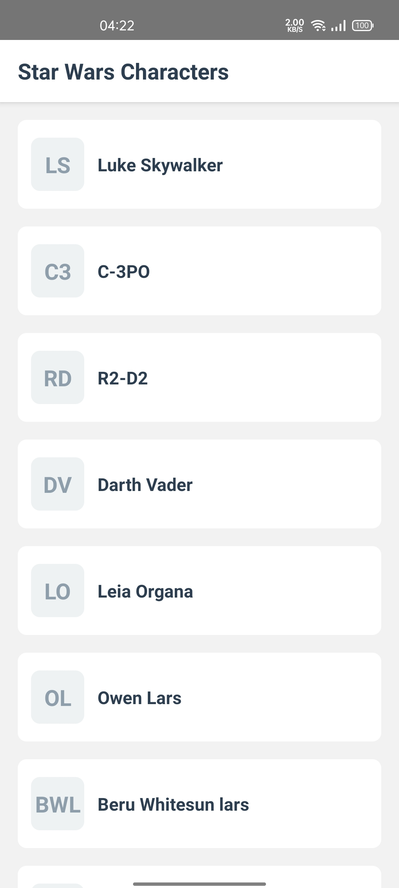
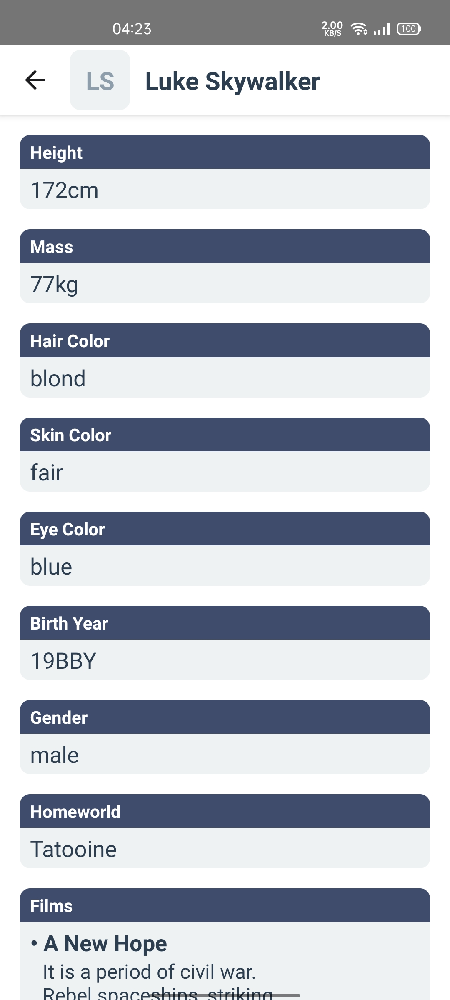

# GeekSeat Technical Test

This repository is a technical test for GeekSeat Job Application. Using `React Native` as its techstack, it can fasten the mobile app development.

## How to start

1. After clone this repository, run:
   ```sh
   yarn
   ```
2. To perform unit test, run:
   ```sh
   yarn test
   ```
3. I suggest to run on Android, because it is optimized for Android. To run the project to android, run:
   ```sh
   yarn android
   ```

## Test Result

```sh
 PASS  src/pages/__tests__/Detail.test.tsx (9.77 s)
  Detail
    ✓ should load page (1248 ms)

 PASS  src/pages/__tests__/Home.test.tsx
  Home
    ✓ should load page (317 ms)
    ✓ should load more on reaching end of the flatlist (161 ms)

 PASS  src/components/__tests__/PeopleCard.test.tsx
  PeopleCard
    ✓ should load component (111 ms)
    ✓ should navigate on press to detail page (6 ms)

 PASS  src/components/__tests__/LabelMultipleValues.test.tsx
  LabelMultipleValues
    ✓ should load component (80 ms)

 PASS  src/components/__tests__/Initial.test.tsx
  Initial
    ✓ should load component and show valid initials (81 ms)

 PASS  src/components/__tests__/LabelValue.test.tsx
  LabelValue
    ✓ should load component (68 ms)

--------------------------|---------|----------|---------|---------|-------------------
File                      | % Stmts | % Branch | % Funcs | % Lines | Uncovered Line #s 
--------------------------|---------|----------|---------|---------|-------------------
All files                 |   97.18 |    68.75 |    92.3 |    97.6 |                   
 mocks                    |     100 |      100 |     100 |     100 |                   
  fileMock.js             |     100 |      100 |     100 |     100 |                   
 src                      |    90.9 |      100 |      50 |    90.9 |                   
  App.tsx                 |    90.9 |      100 |      50 |    90.9 | 36                
 src/components           |     100 |       50 |     100 |     100 |                   
  Initial.tsx             |     100 |       50 |     100 |     100 | 12-16             
  LabelMultipleValues.tsx |     100 |       50 |     100 |     100 | 19                
  LabelValue.tsx          |     100 |      100 |     100 |     100 |                   
  PeopleCard.tsx          |     100 |      100 |     100 |     100 |                   
  index.ts                |     100 |      100 |     100 |     100 |                   
 src/pages                |   97.22 |    79.06 |     100 |   96.66 |                   
  Detail.tsx              |   97.56 |       80 |     100 |   97.43 | 121               
  Home.tsx                |   96.29 |       75 |     100 |   94.73 | 37                
  index.ts                |     100 |      100 |     100 |     100 |                   
 src/services             |   95.65 |        0 |      50 |     100 |                   
  CoreService.ts          |   85.71 |        0 |      50 |     100 | 25-29             
  FilmService.ts          |     100 |      100 |     100 |     100 |                   
  PlanetService.ts        |     100 |      100 |     100 |     100 |                   
  SpeciesService.ts       |     100 |      100 |     100 |     100 |                   
  StarshipService.ts      |     100 |      100 |     100 |     100 |                   
  VehicleService.ts       |     100 |      100 |     100 |     100 |                   
  index.ts                |     100 |      100 |     100 |     100 |                   
--------------------------|---------|----------|---------|---------|-------------------
Test Suites: 6 passed, 6 total
Tests:       8 passed, 8 total
Snapshots:   0 total
Time:        13.28 s
```

## Screenshot


Home Page


Detail Page